<div align="center">
  <h1>Guía para proyectos en Django</h1>
</div>

<div align="center">
  
</div>

# Tabla de contenido
- [Preparando entorno](#Preparando-entorno)
  - [Configuración de entorno de trabajo](#configuración-de-entorno-de-trabajo)
  - [Creacion de entorno virtual con Python](#Creacion-de-entorno-virtual-con-Python)
  - [Comandos del entorno](#Comandos-del-entorno)
  - [Instalación de Django](#Instalación-de-Django)
  - [Django Admin](#Django-Admin)
  - [Creación de proyecto](#Creación-de-proyecto)
  - [Exploración de los archivos](#Exploración-de-los-archivos)
    - [settings.py](#Archivo-settings.py)
    - [manage.py](#Archivo-manage.py)
  - [Levantar servicio](#Levantar-servicio)
- [Vistas](#Vistas)
  - [Crear la primera vista](#Crear-la-primera-vista)
  - [Como Django procesa un request](#Como-Django-procesa-un-request)
  - [Separando las vistas](#Separando-las-vistas)
  - [El objeto Request](#El-objeto-Request)
  - [Pasando argumentos por URL](#Pasando-argumentos-por-URL)
  - [Crear una app](#Crear-una-app)
  - [Template system](#Template-system)
  - [Pasando datos a nuestro template](#Pasando-datos-a-nuestro-template)
- [Modelos](#Modelos)
  - [Dashboard de Administración](#Dashboard-de-Administración)
  - [Implementación de modelos](#Implementación-de-modelos)
  - [Implementar modelos en base de datos](#Implementar-modelos-en-base-de-datos)
  - [Reflejar modelos en dashboard de administración](#Reflejar-modelos-en-dashboard-de-administración)
  - [Dashboard administrativo personalizado](#Dashboard-administrativo-personalizado)
  - [Personalizando detalle de registro de modelo](#Personalizando-detalle-de-registro-de-modelo)
  - [Personalizando Dashboards Nativos](#Personalizando-Dashboards-Nativos)
  - [Relacionando modelos](#Relacionando-modelos)
  - [Hacer funcionar los links](#Hacer-funcionar-los-links)
- [Templates, auth y middlewares](#Templates,-auth-y-middlewares)
  - [Archivos estáticos](##Archivos-estáticos)
  - [Templates](#Templates)

# Preparando entorno

## Configuración de entorno de trabajo
Primero debemos tener instalado Python. Luego de la instalacion abrimos la terminal y nos posicionamos en la ruta que deseamos establecer nuestro proyecto.

## Creacion de entorno virtual con Python
Vamos a crear un entorno virtual para nuestro proyecto, el cual contendra todas las dependencias. Es muy importante que este entorno este fuera de nuestro proyecto. Para crearlo ejecutamos:

```
python -m venv .env
```

Nota: .env sera el nombre de nuestro entorno.

## Comandos del entorno

Para **activar** nuestro entorno ejecutamos

```
source .env/bin/activate
```

Y para **desactivarlo**

```
deactivate
```

Si queremos **listar las librerias instaladas** usamos

```
pip freeze
```

## Instalación de Django
Para **instalar** la ultima version de Django ejecutamos

```
pip install django -U
```

## Django Admin
Es una interfaz instalada junto con Django que contiene subcomandos que utiles. Para listar los subcomandos utilizamos

```
django-admin
```

## Creación de proyecto
Para **crear** un proyecto ejecutamos

```
django-admin startproject name
```

## Exploración de los archivos
Lo primero que veremos es un folder con el nombre de nuestro proyecto, el cual contiene los archivos:

- **\_\_init_\_.py:** la unica finalidad de este archivo es declarar nuestra carpeta como un modulo de python.
- **settings.py:** es el mas importante, define todas las configuraciones de nuestro proyecto.
- **urls.py:** es el archivo de punto de entrada para todas las peticiones a nuestro proyecto.
- **wsgi.py:** es usado para el deployment a produccion y es la interfaz WSGI cuando el servidor corre en producción.
- **manage.py:** es un archivo que no tocamos, pero interactuamos con el durante todo el desarrollo.

### Archivo settings.py
Dentro del archivo setting podemos encontrar variables relevantes para nuestro proyecto, las cuales son:
- **BASE_DIR:** Declara el lugar donde esta corriendo el proyecto. Se considera la linea mas importante.
- **SECRET_KEY:** Es utilizado para el hashing de las contraseñas y las sesiones que se almacenan en las bases de datos.
- **DEBUG:** Determina si nuestro proyecto se encuentra en desarrollo.
- **ALLOWED_HOSTS:** Lista los host que estan permitidos para interactuar con nuestro proyecto.
- **INSTALLED_APPS:** Lista las aplicaciónes instaladas y ligadas a nuestro proyecto.
- **MIDDLEWARE:** Lista los middleware instalados y ligados a nuestro proyecto.
- **ROOT_URLCONF:** Define el archivo principal de urls.
- **TEMPLATES:** Los templates de nuestras aplicaciónes.
- **WSGI_APPLICATION:** Archivo de entrada de nuestro WSGI.
- **DATABASES:** Almacena las configuraciones de las bases de datos.
- **AUTH_PASSWORD_VALIDATORS:** Los validadores de contraseñas.
- **LANGUAGE_CODE:** El idioma en el que se interactua con nuestra aplicación.
- **TIME_ZONE:** Zona horaria en el cual corre nuestra aplicación.
- **STATIC_URL:** En lugar de resolver la url establecidas en el archivo de urls, va a buscar resolver el archivo estático con la url estalecida en esta variable.

### Archivo manage.py
Este archivo contiene un gran listado de subcomandos los cuales podemos listar con:

```
python manage.py
```

## Levantar servicio
Para levantar el servicio ejecutamos:

```
python manage.py runserver
```

# Vistas

## Crear la primera vista
Para este ejercicio lo haremos simple. En el archivo **urls.py** importamos **django.http.HttpResponse** y definimos una **funcion** que devuelva una respuesta (en este caso hello_world), y establemos en que path estara esta despuesta:

```py
from django.contrib import admin
from django.urls import path
from django.http import HttpResponse

def hello_world(request):
  return HttpResponse('Hello, world!')

urlpatterns = [
  path('hello-world/', hello_world)
]
```

Corremos nuestro servidor con

```
python manage.py runserver
```

Luego accedemos al [**http://localhost:8000/hello-world**](http://localhost:8000/hello-world) donde podremos acceder a nuestra vista:

<div align="center">
  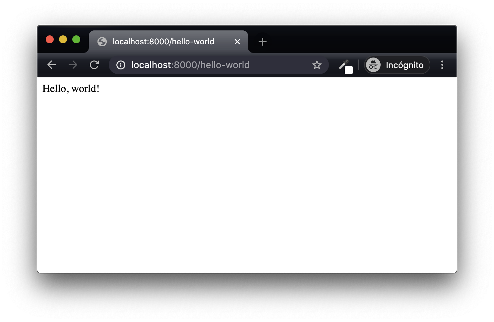
</div>


## Como Django procesa un request
1. Primero va a buscar en el archivo **settings.py** en la variable **ROOT_URLCONF**
2. Luego Django desde el archivo **urls.py** carga los modulos de Python definidos en la variable **urlpatterns**
3. Dentro de **urlpatterns** se busca el patron coincidente a la peticion
4. Una vez encontrado la URL que coincide, Django importa y llama la vista en una funcion simple en Python. Se le pasa como argumento:
    - Una instancia del HttpRequest
    - Si la URL pasa mas argumentos entonces los entregara
    - Si definimos argumentos adicionales tambien lo enviara
5. Si ninguna URL coincide, Django enviara una excepción

## Separando las vistas
Es buena practica tener las vistas separadas del archivo url.py, por lo que crearemos un archivo **views.py** dentro de nuestra aplicación que contendra las vistas:

<div align="center">
  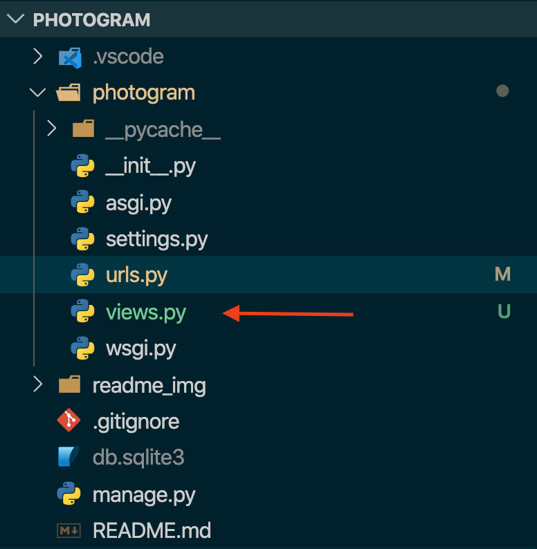
</div>

Dentro de nuestro archivo **views.py** importamos **HttpResponse** y traemos nuestra funcion **hello_world()** creado en urls.py

```py
from django.http import HttpResponse

def hello_world(request):
    return HttpResponse('Hello, world!')
```

Ahora debemos importar nuestra funcion al archivo **urls.py**.
No olvidemos **borrar** la importacion de HttpResponse y la funcion hello_world() en el archivo.

```py
from django.contrib import admin
from django.urls import path
from photogram import views

urlpatterns = [
    path('hello-world/', views.hello_world)
]
```

Si revisamos la url [**http://localhost:8000/hello-world**](http://localhost:8000/hello-world) nuestro proyecto seguira funcionando.

## El objeto Request
A traves del objeto request podemos acceder a varios atributos  los cuales se encuentran detallados en la [documentación](https://docs.djangoproject.com/en/3.0/ref/request-response/) de Django. Algunos atributos utiles son:

- **request.method:** nos muestra el metodo HTTP ("GET", "POST", etc.) usado por el request en formato de string en UPPERCASE. Un ejemplo de uso seria:

  ```py
  if request.method == 'GET':
    do_something()
  elif request.method == 'POST':
    do_something_else()
  ```

- **request.GET:** Un diccionario que contiene todos los parametros entregados por HTTP GET. Por ejemplo:

  Pasamos una lista de numeros en la variable numbers **(?numbers)**

  ```http
  http://localhost:8000/numbers/?numbers=10,2,6,7
  ```

  Para acceder a la lista usamos 

  ```py
  request.GET['numbers']
  ```

  *Nota: En el siguiente ejemplo se creo la vista numbers*
  
  Un ejemplo practico seria:

  ```py
  def numbers(request):
    numbers = request.GET['numbers']
    return HttpResponse(str(numbers))
  ```

  De esta forma podemos ver los valores de number a traves de nuetra vista.

  <div align="center">
    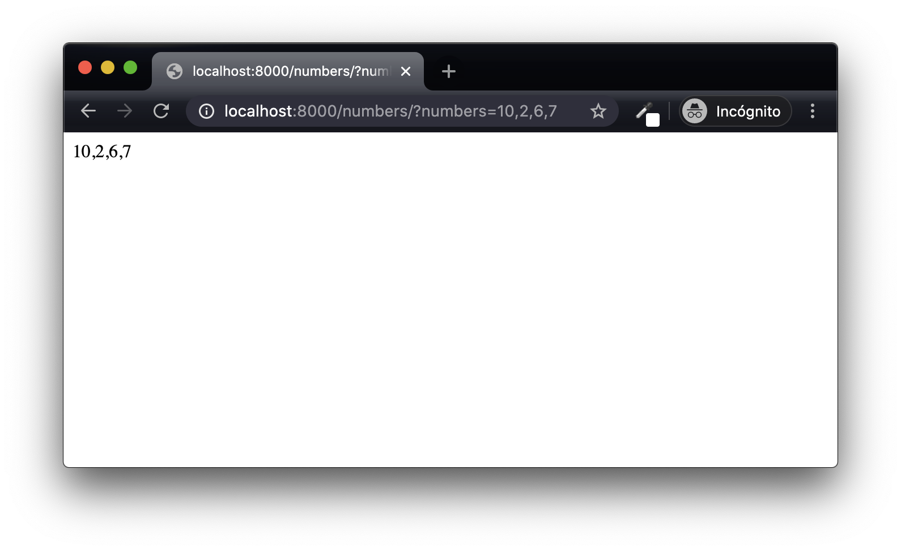
  </div>

## Pasando argumentos por URL
Podemos pasar argumentos a traves de la URL, para esto primero creamos la funcion que hara uso de estos parametros y devolvera la vista en el archivo **views.py**
```py
from django.http import HttpResponse

def say_hi(request, name, age):
  if age < 12:
    message = 'Sorry {}, you are not allowed here'.format(name)
  else:
    message = 'Hello {}! Welcome to Photogram'.format(name)
    
  return HttpResponse(message)
```

Luego definimos el path para esta vista en el archivo **urls.py**. Para definir los parametros que pasaran por la url los encerramos con "<>" definiendo el tipo de dato y el nombre del parametro.

```py
from django.contrib import admin
from django.urls import path
from photogram import views

urlpatterns = [
  path('hi/<str:name>/<int:age>/', views.say_hi)
]
```

En el resultado final si ingresamos **age = 26** y **name = Karl** obtenemos el resultado definido en nuestra funcion **say_hi()**:

<div align="center">
    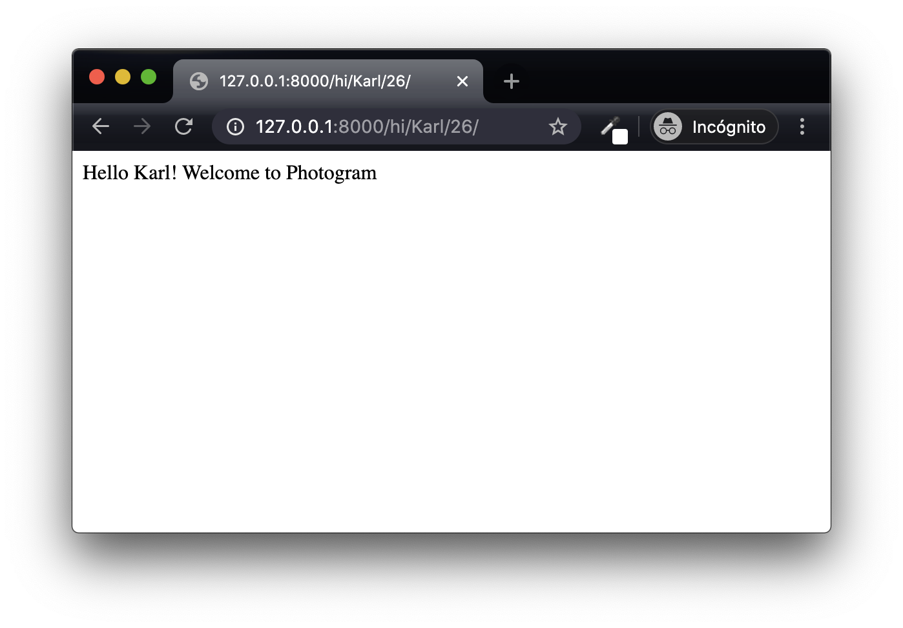
</div>

Pero si cambiamos **age = 10** obtenemos:

<div align="center">
    
</div>

## Crear una app
Con Django podemos crear una app de forma rapida y sencilla ejecutando el comando

```
python manage.py startapp name
```

En este ejemplo creamos un app llamada **posts**, el cual genero una carpeta con todos los archivos basicos necesarios

<div align="center">
    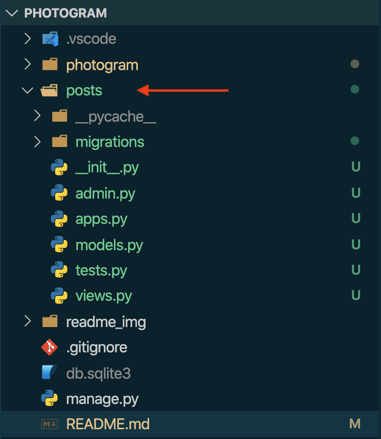
</div>

Para desplegar una vista de esta aplicacion vamos al archivo *./posts/views.py* donde crearemos una vista a traves de la funcion **list_posts()**

```py
from django.shortcuts import render
from django.http import HttpResponse

def list_posts(request):
  posts = [1, 2, 3, 4]
  return HttpResponse(str(posts))
```

Luego vamos al archivo settings de nuestro proyecto, en este caso *./photogram/settings.py* donde incorporaremos en la variable **INSTALLED_APPS** nuestra nueva app

```py
INSTALLED_APPS = [
    # Django apps
    'django.contrib.admin',
    'django.contrib.auth',
    'django.contrib.contenttypes',
    'django.contrib.sessions',
    'django.contrib.messages',
    'django.contrib.staticfiles',

    # Local apps
    'posts',
]
```

Ahora nos toca asignar un path para nuestra vista **list_posts()**. Para eso vamos al archivo **urls.py** de nuestro proyecto, en este caso *./photogram/urls.py* e importamos nuestra nueva app, y le asignamos un path a nuestra vista.

Para que no existan conflictos al llamar views vamos asignar un **alias** para las views de cada aplicacion.

```py
from django.contrib import admin
from django.urls import path
from photogram import views as local_views

# Importamos las vistas de nuestra aplicacion posts
from posts import views as posts_views

urlpatterns = [
    
    path('hello-world/', local_views.hello_world),
    path('numbers/', local_views.numbers),
    path('hi/<str:name>/<int:age>/', local_views.say_hi),

    # Asignamos el path para nuestra vista list_posts
    path('posts/', posts_views.list_posts),

]
```

Ahora vamos a [**http://localhost:8000/posts/**](http://localhost:8000/posts/) para ver nuestro resultado

<div align="center">
    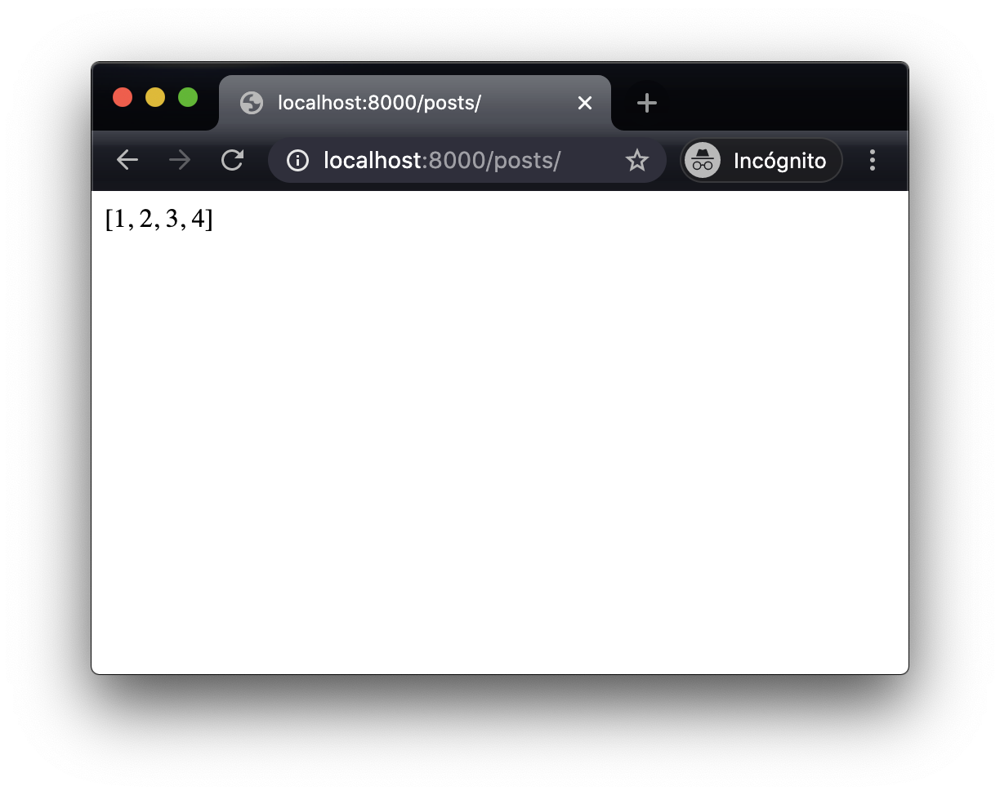
</div>

## Template system

El template system es una manera de mostrar los datos usando HTML, incluye lógica de programacion lo cual nos facilita un poco el crear nuestros templates.

Para crear nuestros templates lo que haremos es dentro de nuestra aplicacion **crear una carpeta templates** y un **archivo html** con el nombre de nuestro template, en este caso _feed.html_

<div align="center">
    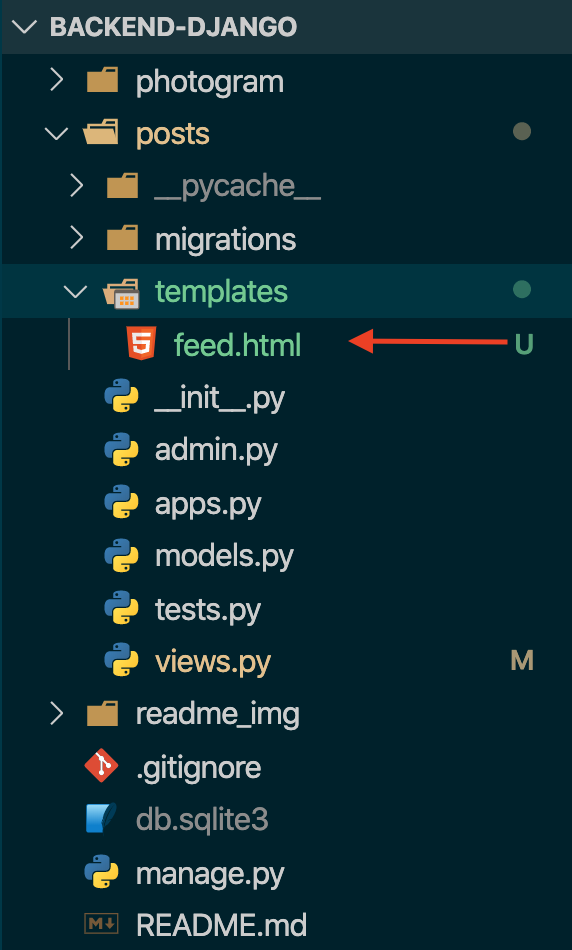
</div>

Dentro de nuestro archivo **feed.html** solo escribiremos:

```html
Hola, mundo!
```

Y dentro de **views.py** de nuestra aplicación ya no es necesario el HttpResponse, por que borramos su importación. A través de la función que devolvemos nuestra vista devolveremos nuestro nuevo template con el metodo **render**, que le pasaremos la request y la vista:

```py
from django.shortcuts import render

def list_posts(request):
    return render(request, 'feed.html')
```

Si revisamos el path [**http://localhost:8000/posts/**](http://localhost:8000/posts/) tendremos nuestro "Hola, mundo!"

<div align="center">
    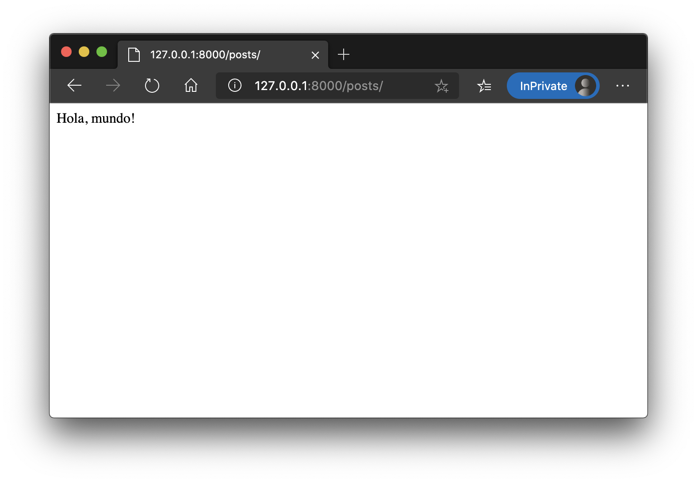
</div>

¿Como logro funcionar si dentro de render jamas definimos la ruta donde buscar nuestro template? (en nuetro caso solo _feed.html_). Si revisamos en el archivo **settings.py** de nuestro proyecto, en la definicion de **TEMPLATES** veremos

```py

...

TEMPLATES = [
    {
        'BACKEND': 'django.template.backends.django.DjangoTemplates',
        'DIRS': [],
        'APP_DIRS': True,
        'OPTIONS': {
            'context_processors': [
                'django.template.context_processors.debug',
                'django.template.context_processors.request',
                'django.contrib.auth.context_processors.auth',
                'django.contrib.messages.context_processors.messages',
            ],
        },
    },
]

...

```

En **APP_DIRS** lo tenemos definido como **True**, esto significa que las aplicaciones buscaran los templates dentro de sus directorios, de esta forma funciona sin tener que nombrar la dirección de nuestro template.

## Pasando datos a nuestro template

Primero crearemos un diccionario de datos dentro de nuestra vista (solo a modo de ejemplo) y enviaremos al template estos datos a traves del render. En nuestro caso este diccionario sera posts

```py
# Django
from django.shortcuts import render

# Utilities
from datetime import datetime

posts = [
    {
        'title': 'Mont Blanc',
        'user': {
            'name': 'Yésica Cortés',
            'picture': 'https://picsum.photos/60/60/?image=1027'
        },
        'timestamp': datetime.now().strftime('%b %dth, %Y - %H:%M hrs'),
        'photo': 'https://picsum.photos/800/600?image=1036',
    },
    {
        'title': 'Via Láctea',
        'user': {
            'name': 'Christian Van der Henst',
            'picture': 'https://picsum.photos/60/60/?image=1005'
        },
        'timestamp': datetime.now().strftime('%b %dth, %Y - %H:%M hrs'),
        'photo': 'https://picsum.photos/800/800/?image=903',
    },
    {
        'title': 'Nuevo auditorio',
        'user': {
            'name': 'Uriel (thespianartist)',
            'picture': 'https://picsum.photos/60/60/?image=883'
        },
        'timestamp': datetime.now().strftime('%b %dth, %Y - %H:%M hrs'),
        'photo': 'https://picsum.photos/500/700/?image=1076',
    }
]

def list_posts(request):
    """List existing posts."""
    return render(request, 'feed.html', {'posts': posts})
```

Si logran observar enviamos los datos a traves de **{'posts': posts}**, el cual el **primer parametro sera el nombre de la variable** al momento de enviar al template, y el **segundo es el valor asignado**.

En nuestro template _feed.html_ ahora imprimiremos nuestro diccionario escribiendo el **nombre de la variable**.

```html
{{ posts }}
```

Si revisamos [**http://localhost:8000/posts/**](http://localhost:8000/posts/) veremos nuestro diccionario.

<div align="center">
    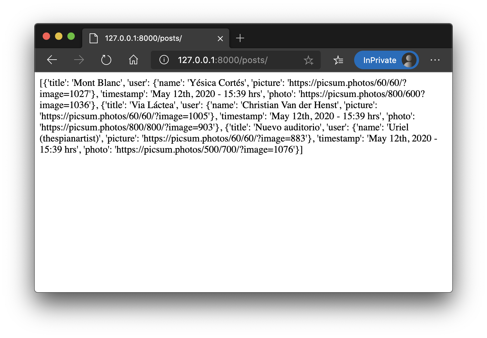
</div>

Ahora juguemos un poco con la **lógica de programación** y **html**. Vamos a imprimir solo los títulos. Para eso en nuestro **template** _feed.html_ escribiremos:

```html

  <p>{{ post.title }}</p>

```

Y el resultado en [**http://localhost:8000/posts/**](http://localhost:8000/posts/)

<div align="center">
    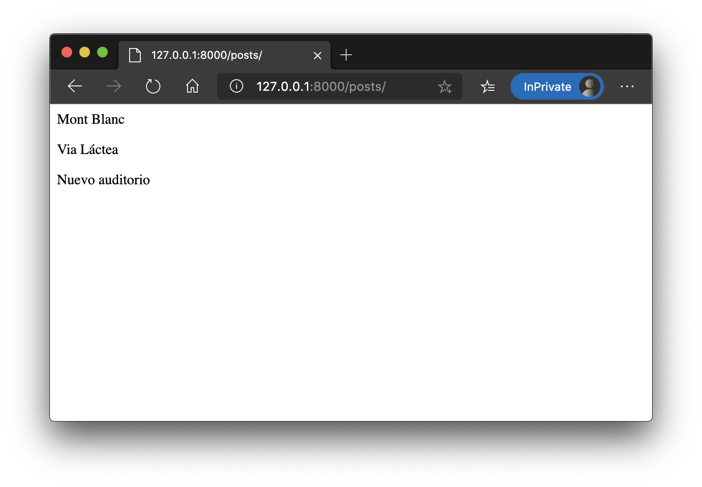
</div>

Para ver toda la **lógica de programación** que podemos crear en el template system te recomiendo ir a la [documentación de Django.](https://docs.djangoproject.com/en/3.0/ref/templates/builtins/)

Ahora despleguemos los datos de nuestro diccionario y estilemos con **Bootstrap** nuestro template _feed.html_.

```html
<!DOCTYPE html>
<html lang="en">
<head>
  <meta charset="UTF-8">
  <title>Platzigram</title>
  <link rel="stylesheet" href="https://stackpath.bootstrapcdn.com/bootstrap/4.1.1/css/bootstrap.min.css" integrity="sha384-WskhaSGFgHYWDcbwN70/dfYBj47jz9qbsMId/iRN3ewGhXQFZCSftd1LZCfmhktB" crossorigin="anonymous">
</head>
<body>
  <br><br>
  <div class="container">
    <div class="row">
      
      <div class="col-lg-4 offset-lg-4">
        <div class="media">
          
          <div class="media-body">
            <h5 class="mt-0">{{ post.user.name }}</h5>
            {{ post.timestamp }}
          </div>
        </div>
        
        <h6 class="ml-1 mt-1">{{ post.title }}</h6>
      </div>
      
    </div>
    </div>
</body>
</html>

```

Y en [**http://localhost:8000/posts/**](http://localhost:8000/posts/) veremos
:
<div align="center">
    
</div>

## Creacion de Super Usuario

Para crear un **super usuario** en Django es bastante facil. En la consola escribimos

```
python3 manage.py createsuperuser
```

Nos preguntara un **username, email (opcional), y contrañesa**, con esto ya tendriamos nuestro super usuario.

# Modelos

## Dashboard de Administración

Django cuenta con un dashboard de administración. Para acceder a el debemos darle un path dentro del archivo **urls.py** de nuestro proyecto. Para esto importamos **django.contrib.admin** y le asignamos la dirección que deseamos

```py
from django.contrib import admin
from django.urls import path

urlpatterns = [
  path('admin/', admin.site.urls),
```

En este caso le dimos el path **/admin/** para acceder a el. Entonces vamos a la dirección [**http://localhost:8000/admin/**](http://localhost:8000/admin/) para ingresar.

<div align="center">
    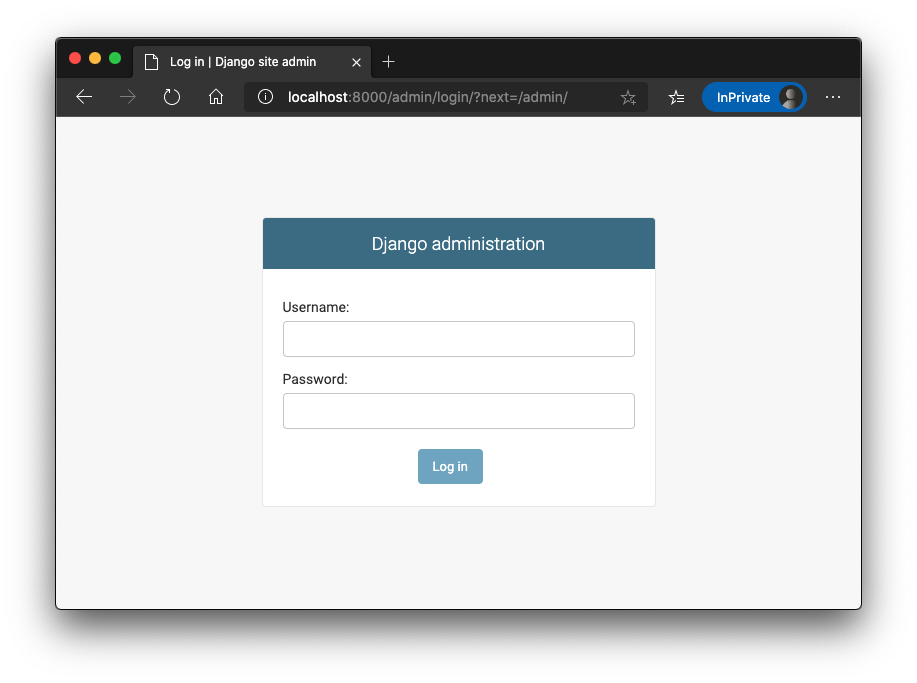
</div>

Para ingresar utilizaremos el **super usuario** que creamos en la [**sección de creación de super usuario.**](#creacion-de-super-usuario)

## Implementación de modelos

Con Django podemos crear modelos de clases de nuestra aplicación.

Para estos ejemplos crearemos una nueva aplicacion de usuarios en nuestro proyecto.

```
python manage.py startapp users
```

En el archivo **models.py** de la nueva aplicación crearemos el modelo de nuestros usuarios, el cual sera una clase _Profile_, y los tipos de valores para la clase _models_ estan definidos en la [documentación.](https://docs.djangoproject.com/en/3.0/ref/models/fields/)

Para poder cargar las referencias de imagenes en neustro modelo instalaremos en nuestro ambiente Pillow, esto nos servira para la siguiente sección.

```
pip install pillow
```

Ahora creamos el modelo de usuarios.

```py
from django.contrib.auth.models import User
from django.db import models

class Profile(models.Model):

  user = models.OneToOneField(User, on_delete=models.CASCADE)

  website = models.URLField(max_length=200, blank=True)
  biography = models.TextField(blank=True)
  phone_number = models.CharField(max_length=20, blank=True)

  picture = models.ImageField(
    upload_to='users/pictures', 
    blank=True, 
    null=True
  )

  created = models.DateTimeField(auto_now_add=True)
  modified = models.DateTimeField(auto_now=True)

  def __str__(self):
    return self.user.username
```

## Implementar modelos en base de datos

Los modelos creados en nuestras aplicaciones podemos aplicarlos en el esquema de nuestra base de datos. Primero debemos auditar los cambios en los modelos con:

```
python manage.py makemigration
```

Ahora aplicaremos los cambios auditados en nuestra base de datos.

```
python manage.py migrate
```

## Reflejar modelos en dashboard de administración

En primera instancia no podremos ver los _modelos_ que creamos en el dashboard de administración. La clase **ModelAdmin** es la representacion del modelo en la interfaz de administración. Para reflejarlo debemos almacenar el _modelo_ en el archivo **admin.py** de nuestra aplicación.

```py
# Django
from django.contrib import admin

# Modelos
from users.models import Profile

# Registramos nuestros modelos aquí.
admin.site.register(Profile)
```

De esta forma tendremos la interfaz de administración predeterminada, en nuestro caso incluimos el modelo **Profile**.

<div align="center">
  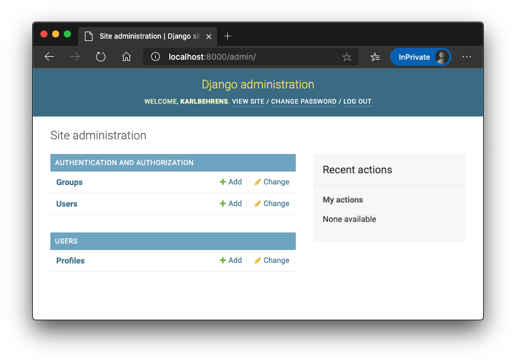
</div>
<div align="center">
  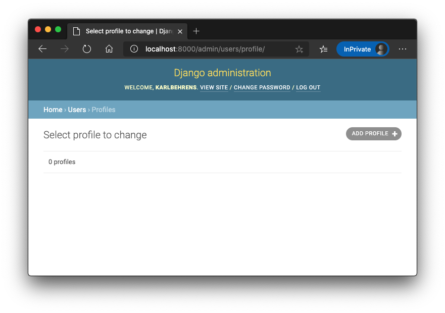
</div>
<div align="center">
  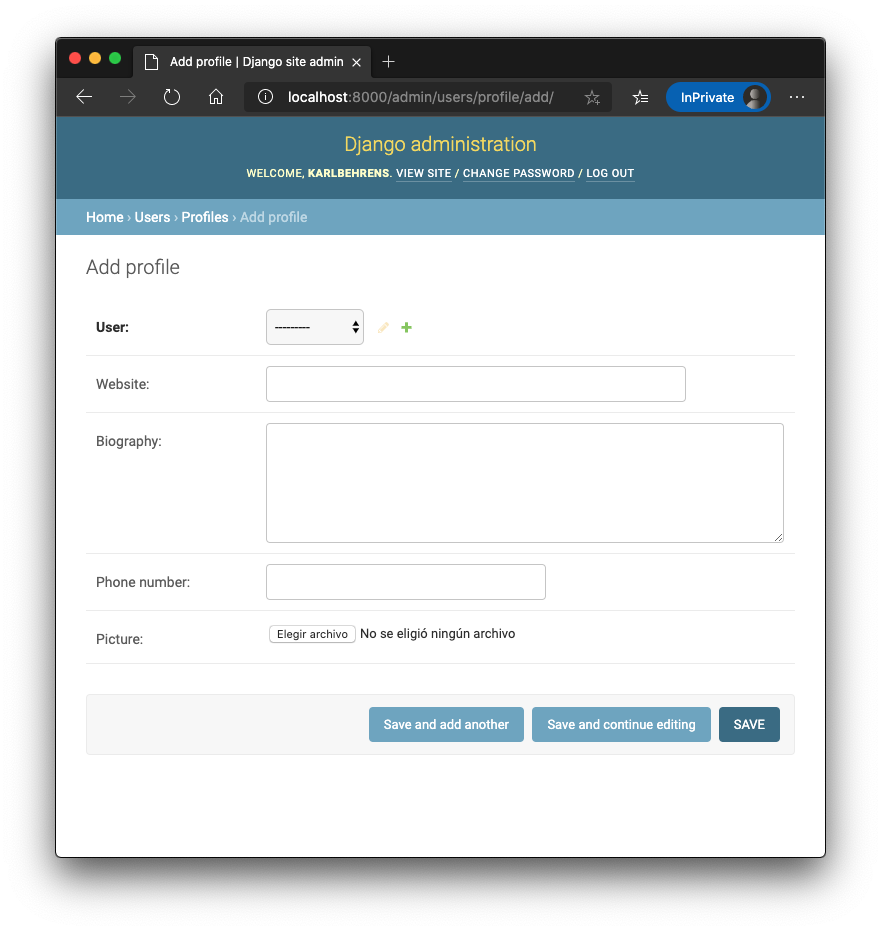
</div>

## Dashboard administrativo personalizado

Si queremos mostrar nuestra lista de modelos de una forma personalizada, con Django podemos realizarlo. Para esto debemos crear una clase **ModelAdmin**

```py
# Django
from django.contrib import admin

# Modelo
from users.models import Profile

# Decoramos la clase con el modelo.
@admin.register(Profile)
class ProfileAdmin(admin.ModelAdmin): #Por convencion la clase que creemos debe terminar en Admin.

  # Con list_display nombramos los campos que queremos visualizar.
  list_display = ('pk', 'user', 'phone_number', 'website', 'picture')

  # list_display_links establece como links los campos nombrados.
  list_display_links = ('pk', 'user')

  # list_editable nos permite editar el campo desde la lista del modelo en vez de ingresar al detalle del registro.
  list_editable = ('phone_number',)

  # Para crear un buscador hacemos uso de search_fields. Los campos que se ingresan seran los que el buscador recorrera para realizar las busquedas.
  search_fields = (
    'user__email',
    'user__username', 
    'user__first_name', 
    'user__last_name', 
    'phone_number'
  )

  # Podemos crear un filtro para nuestro dashboard del modelo, para ello usamos list_filter, y definimos los campos con los que trabajara.
  list_filter = (
    'user__is_active',
    'user__is_staff',
    'created', 
    'modified'
  )
```

<div align="center">
  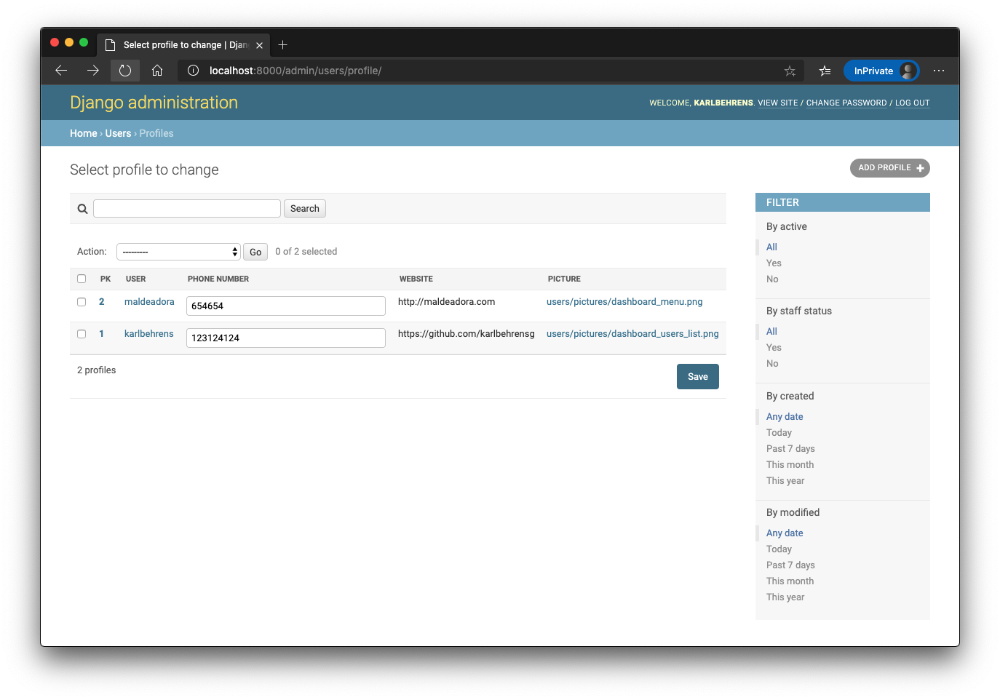
</div>

Para mas opciones de personalización siempre puedes revisar la [documentación.](https://docs.djangoproject.com/en/3.0/ref/contrib/admin/#modeladmin-options)

## Personalizando detalle de registro de modelo

Podemos perzonalizar nuestros dashbord del registro. En nuestro caso lo haremos para el modelo de usuarios _Profile_.

```py
# Django
from django.contrib import admin

# Models
from users.models import Profile

@admin.register(Profile)
class ProfileAdmin(admin.ModelAdmin):
  list_display = ('pk', 'user', 'phone_number', 'website', 'picture')
  list_display_links = ('pk', 'user',)
  list_editable = ('phone_number', 'website', 'picture')
  search_fields = (
    'user__email',
    'user__username', 
    'user__first_name', 
    'user__last_name', 
    'phone_number'
  )
  list_filter = (
    'user__is_active',
    'user__is_staff',
    'created', 
    'modified'
  )

  # Nos desplagara los datos que deseamos. Es importante que la información este en tuplas.
  fieldsets= (
    ('Profile', { # Nombre de la sección.
      'fields': ( # Los campos que visualizaremos.
        ('user', 'picture'), # Cuando ponemos varios campos en la misma posición dentro de la tupla de field vamos a desplegar los datos en la misma fila.
      ),
    }),
    ('Extra info', {
      'fields': ( # En este caso la información se desplegara en 2 filas ya que la tupla de fields tiene 2 posiciones.
        ('website', 'phone_number'),
        ('biography',),
      ),
    }),
    ('Metadata', {
      'fields': (
        ('created', 'modified'), # Estos datos no se pueden modificar, por lo que haremos uso de readonly_fields.
      ),
    }),
  )

  # Aqui declararemos los campos que solo pueden ser leidos pero no modificados.
  readonly_fields = ('created', 'modified',)
```
<div align="center">
  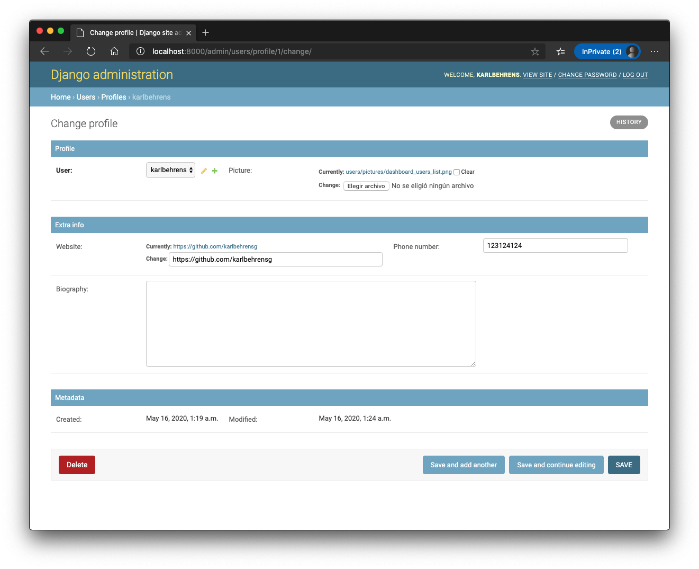
</div>

En la [documentación](https://docs.djangoproject.com/en/3.0/ref/contrib/admin/#modeladmin-options) tenemos muchas mas formas de personalización.

## Personalizando Dashboards Nativos

Existe la posibilidad de personalizar los dashboard nativos de Django, para ello vamos a trabajar sobre el modelo de **Users** para el cual vamos a visualizar los datos que definamos y tambien al momento de crear un usuario tambien podremos crear dentro del proceso una instancia de nuestro modelo _Profile_

```py
# Django
# Importamos UserAdmin
from django.contrib.auth.admin import UserAdmin as BaseUserAdmin
from django.contrib import admin

# Models
# Tambien haremos uso de User
from django.contrib.auth.models import User
from users.models import Profile

@admin.register(Profile)
class ProfileAdmin(admin.ModelAdmin):
  list_display = ('pk', 'user', 'phone_number', 'website', 'picture')
  list_display_links = ('pk', 'user',)
  list_editable = ('phone_number', 'website', 'picture')
  search_fields = (
    'user__email',
    'user__username', 
    'user__first_name', 
    'user__last_name', 
    'phone_number'
  )
  list_filter = (
    'user__is_active',
    'user__is_staff',
    'created', 
    'modified'
  )

  fieldsets= (
    ('Profile', {
      'fields': (
        ('user', 'picture'),
      ),
    }),
    ('Extra info', {
      'fields': (
        ('website', 'phone_number'),
        ('biography',),
      ),
    }),
    ('Metadata', {
      'fields': (
        ('created', 'modified'),
      ),
    }),
  )

  readonly_fields = ('created', 'modified',)

# Aqui definiremos el modelo que deseamos asociar a User, en nuestro caso Profile.
class ProfileInline(admin.StackedInline):
  model = Profile
  can_delete = False
  verbose_name_plural = 'profiles'

# Luego para asociar los modelos e insertarlo en el Dashboard usaremos el UserAdmin de Django el cual le dimos el alias de BaseUserAdmin.
class UserAdmin(BaseUserAdmin):
  inlines = (ProfileInline,) # Con inlines desplegaremos los campos que hay que llenar asociados a Profile.
  list_display = ( # En list_display
    'username',
    'email',
    'first_name',
    'last_name',
    'is_active',
    'is_staff'
  )

admin.site.unregister(User)
admin.site.register(User, UserAdmin)
```

Si vamos a crear un nuevo **User** podremos encontrar los campos asociados a nuestro modelo _Profile_ que definimos en la variable _inlines_

<div align="center">
  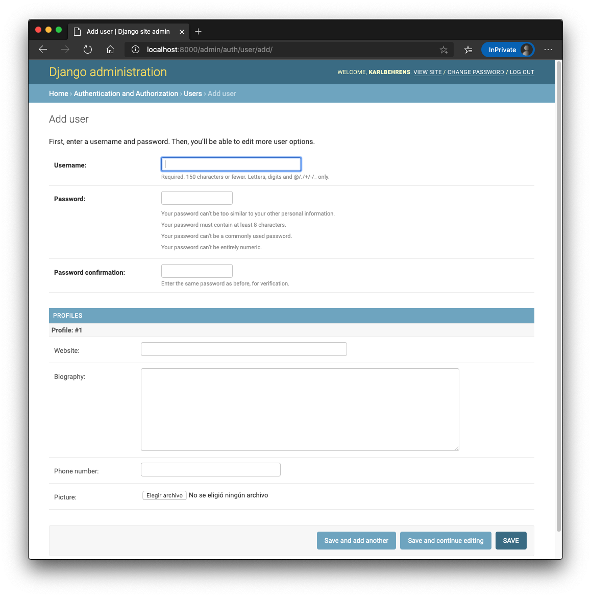
</div>

Y si revisamos la lista de registro **User** veremos los cambios realizados en la variable _list_display_.

<div align="center">
  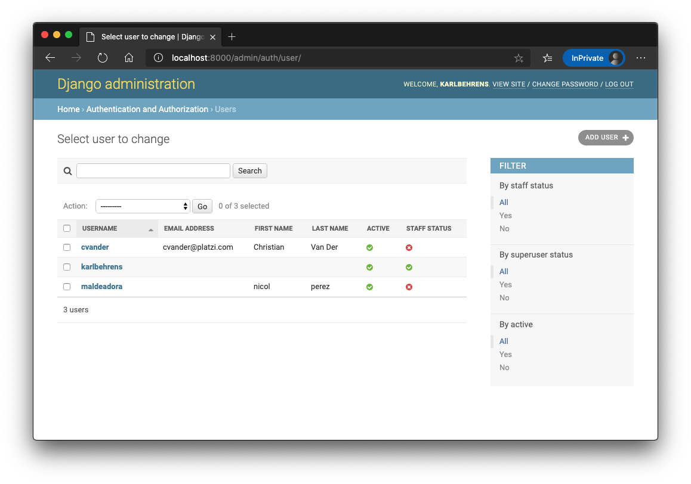
</div>

En la [documentación](https://docs.djangoproject.com/en/3.0/ref/contrib/admin/#modeladmin-options) tenemos muchas mas formas de personalización.

## Relacionando modelos

¿Que pasa si en nuestro proyecto un modelo depende de otro? Un ejemplo de esto puede ser un **_post_** que solo es posible que exista si esta relacionado con un **_usuario_**. Afortunadamente en Django podemos relacionar los modelos, en nuestro caso lo haremos con el modelo de **posts**, por lo iremos al archivo _posts/models.py_.

```py
# Django
from django.db import models
from django.contrib.auth.models import User

class Post(models.Model):

  user = models.ForeignKey(User, on_delete=models.CASCADE)
  profile = models.ForeignKey('users.Profile', on_delete=models.CASCADE) # Con ForeignKey podemos relacionar el modelo de posts con profile, y para hacer referencia a la clase relacionada lo hacemos con el formato de 'aplicacion.NombreClaseDelModelo'.

  title = models.CharField(max_length=255)
  photo = models.ImageField(upload_to='post/photos')

  created = models.DateTimeField(auto_now_add=True)
  modified = models.DateTimeField(auto_now=True)

  def __str__(self):
    return '{} by @{}'.format(self.title, self.user.username)
```

## Hacer funcionar los links

¿Te fijaste que los links de los campos de nuestros registros nos llevaba al detalle de estos? Para que estos links nos lleven realmente a sus referencias debemos realizar algunos cambios en el archivo **urls.py** y **settings.py**.

En nuestro archivo **settings.py** declararemos 2 variables en el fondo del archivo.

```py
...

MEDIA_ROOT = os.path.join(BASE_DIR, 'media')
MEDIA_URL = '/media/'
```

Luego iremos al archivo **urls.py** y a _urlpatterns_ donde tenemos definidos los path de nuestras aplicaciones vamos a concatenar un valor static

```py
from django.contrib import admin
from django.conf import settings
from django.conf.urls.static import static
from django.urls import path

from photogram import views as local_views
from posts import views as posts_views

urlpatterns = [

    path('admin/', admin.site.urls),
    
    path('hello-world/', local_views.hello_world),
    path('numbers/', local_views.numbers),
    path('hi/<str:name>/<int:age>/', local_views.say_hi),

    path('posts/', posts_views.list_posts),

] + static(settings.MEDIA_URL, document_root=settings.MEDIA_ROOT) # concatenamos static con los valores definidos en settings.py
```

Con esto estaría todo listo para que los valores definidos como links en los dashboard funcionen correctamente.

# Templates, auth y middlewares

## Archivos estáticos

Los archivos estáticos son elementos de nuestro proyecto que podremos usar de forma transversal. Técnicamente podemos usar tipo de elemento como estético pero por lo general se hacen uso de **css** e **imágenes.**

En la raíz de nuestro proyecto crearemos una carpeta llamada _static_, y en ella contendra otras 2 carpetas llamadas _css_ y _img_. Estas van a contener nuestros archivos **css** e **imagenes** respectivamente.

<div align="center">
  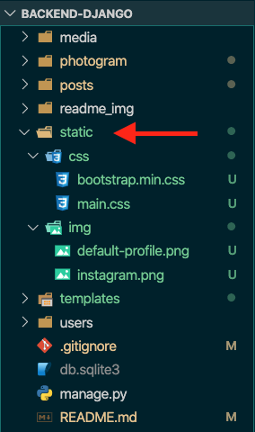
</div>

Ahora vamos al archivo _settings.py_ de nuestro proyecto. Justo debajo de la variable **STATIC_URL** vamos a pegar las variables de **STATICFILES_DIRS** y **STATICFILES_FINDERS**.

```py
...

STATICFILES_DIRS = (
    os.path.join(BASE_DIR, 'static'),
)
STATICFILES_FINDERS = [
    'django.contrib.staticfiles.finders.FileSystemFinder',
    'django.contrib.staticfiles.finders.AppDirectoriesFinder',
]

...
```

Con esto tus archivos estáticos ya pueden ser referenciados.

## Templates

Los templates de nuestro proyecto tienen la capacidad de **extenderse** desde otros templates, asi podremos reutilizar los elementos que deseamos, como por ejemplo un _navbar_.

Para preparar todo iremos al archivo _settings.py_, y en la variable **TEMPLATES** vamos a definir donde buscar los **templates** para nuestro proyecto.

```py
TEMPLATES = [
    {
        'BACKEND': 'django.template.backends.django.DjangoTemplates',
        'DIRS': [
            # Aqui definimos la carpeta donde ira a buscar el template nuestras aplicaciones.
            os.path.join(BASE_DIR, 'templates'),
        ],
        'APP_DIRS': True,
        'OPTIONS': {
            'context_processors': [
                'django.template.context_processors.debug',
                'django.template.context_processors.request',
                'django.contrib.auth.context_processors.auth',
                'django.contrib.messages.context_processors.messages',
            ],
        },
    },
]
```

Ln la **raíz** de nuestro proyecto crearemos la carpeta _templates_ definido anteriormente y dentro de este crearemos todos los elementos compartidos, como por ejemplo un **navbar, base, etc.** Para los templates **no compartidos** que deseamos agregar vamos a crear **carpetas** de estos elementos. Para nuestro ejemplo vamos a crear los templates compartidos de **base** y **navbar**, y para los elementos particulares crearemos las carpetas **posts** y **users**, con los archivos _feed.html_ y _base.html_ respectivamente.

<div align="center">
  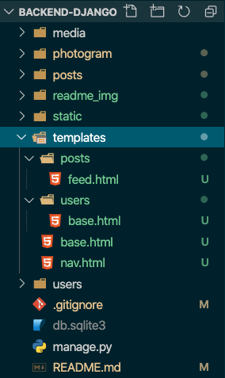
</div>

Primero vamos a crear nuestro navbar en el archivo _templates/**nav.html**_ y haremos referencias a nuestros **archivos estáticos** creados en la [sección anterior.](#Archivos-estáticos)

```html
<!-- Cargamos las refenrencias a los dir static -->

<nav class="navbar navbar-expand-lg fixed-top" id="main-navbar">
  <div class="container">

    <a class="navbar-brand pr-5" style="border-right: 1px solid #efefef;" href="">
      <!-- Vamos a referenciar a la imagen de instagram en statics -->
      
    </a>

    <div class="collapse navbar-collapse">
      <ul class="navbar-nav mr-auto">

        <li class="nav-item">
          <a href="">
            <!-- Aqui referenciamos otra imagen -->
            
          </a>
        </li>

        <li class="nav-item nav-icon">
          <a href="">
            <i class="fas fa-plus"></i>
          </a>
        </li>

        <li class="nav-item nav-icon">
          <a href="">
            <i class="fas fa-sign-out-alt"></i>
          </a>
        </li>

      </ul>
    </div>
  </div>
</nav>
```

Sin embargo nuestro **navbar** aun no aparecera en nuestra aplicación. Para esto crearemos el archivo _templates/**base.html**_ y como lo hicimos en el archivo anterior vamos a cargar los **archivos estáticos.** Pero no nos detengamos ahí, tambien definamos el **bloque del head** y el **container que desplegara los templates** que se extenderan.

```html
<!DOCTYPE html>
<html lang="en">
<head>
  <meta charset="UTF-8">
  <!-- Definimos el bloque head_content donde nuestros templates definiran su valor -->
  

  <!-- Cargamos las referencias a los archivos estáticos -->
  
  <link rel="stylesheet" href="">
  <link rel="stylesheet" href="https://use.fontawesome.com/releases/v5.1.0/css/all.css" crossorigin="anonymous" />
  <link rel="stylesheet" href="" />

</head>
<body>
  <!-- Incluimos el template de navbar que creamos anteriormente -->
  

  <div class="container mt-5">
    <!-- Creamos el bloque donde se desplegaran los templates de nuestra aplicacion -->
    
    
  </div>

</body>
</html>
```

Con esto ya desplegamos nuestro template **navbar** dentro de **base**, pero no nos detengamos ahí. Vamos a crear el template para **posts** que se **extendera** del archivo _templates/base.html_, el cual sera _templates/posts/**feed.html**_

```html
<!-- Extendemos este template de nuestro archivo templates/base.html -->


<!-- Definimos el contenido del head en el bloque head_content -->

<title>Platzigram feed</title>


<!-- Desplegamos el contenido de nuestro template en el bloque container definido del archivo que se extiende -->

  <div class="row">
    
    <div class="col-lg-4 offset-lg-4">
      <div class="media">
        
        <div class="media-body">
          <h5 class="mt-0">{{ post.user.name }}</h5>
          {{ post.timestamp }}
        </div>
      </div>
      
      <h6 class="ml-1 mt-1">{{ post.title }}</h6>
    </div>
    
  </div>

```

Como ahora este template esta fuera de la aplicación debemos referenciarla en el render de la vista, por lo que iremos a _posts/views.py_ a realizar los cambios. Lo referenciaremos como _**posts/feed.html**_ que hace referencia al path de _template/posts/feed.html_. **No es necesario definir la carpeta _templates_** ya que en el archivo _settings.py_ definimos que **los templates seran buscados en esta carpeta**.

```py
...

def list_posts(request):
    # En la función que nos devuelve el render, debemos referenciar correctamente el template, en este caso a posts/feed.html
    return render(request, 'posts/feed.html', {'posts': posts})
```

Ahora si revisamos el path de la aplicación [http://localhost:8000/posts/](http://localhost:8000/posts/) veremos el template de **base**, **navbar** y **posts** desplegados correctamente, ademas del head definido en _templates/posts/feed.html_

<div align="center">
  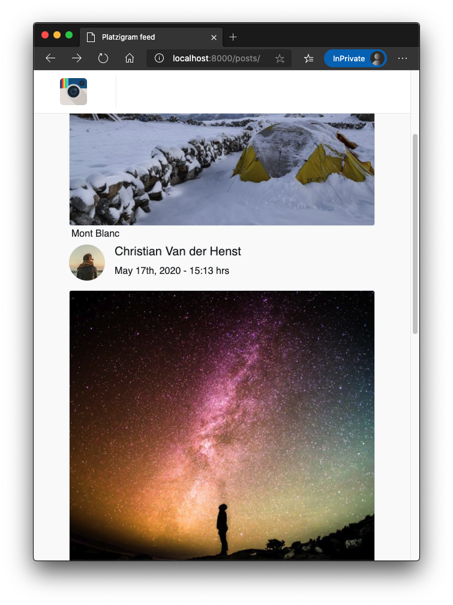
</div>